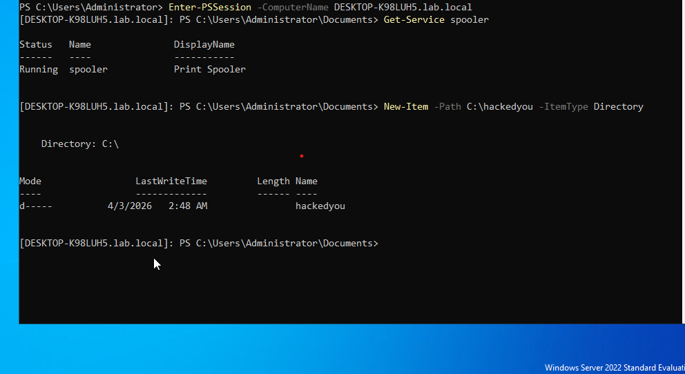
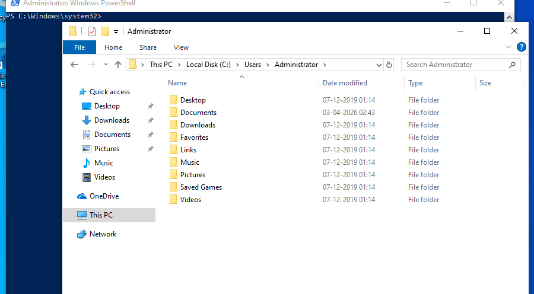
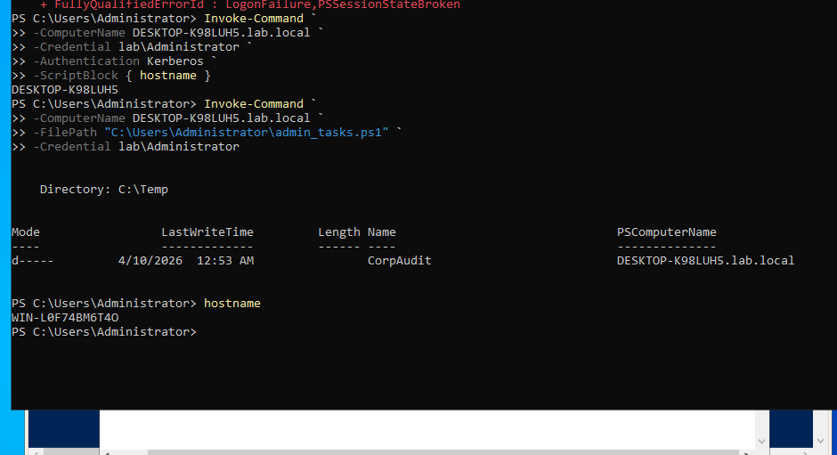
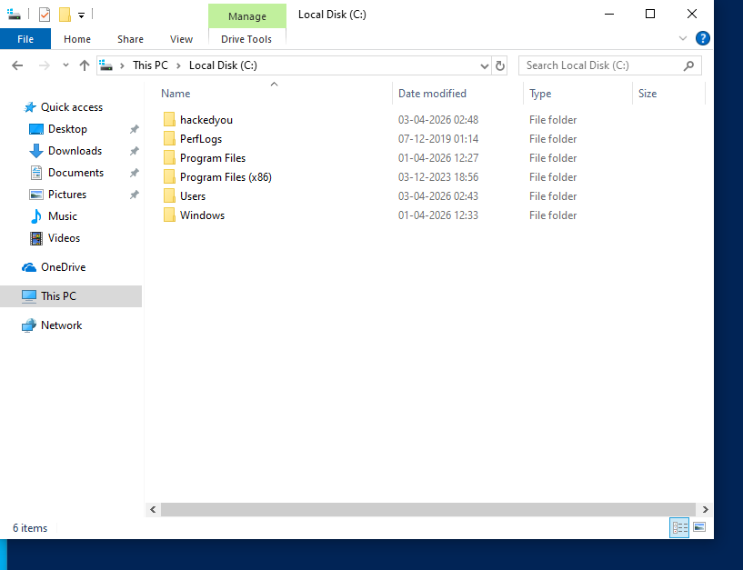

# 🖥️ Active Directory Lab with PowerShell Remoting

## ⭐ Project Highlights

* Built enterprise-style Active Directory lab using VMware
* Configured DNS and networking between domain controller and client
* Implemented PowerShell Remoting (WinRM)
* Executed remote commands across machines
* Troubleshot Kerberos, DNS, and authentication issues

---

## 📌 Overview

This project demonstrates an enterprise-style Active Directory lab setup using VMware, including DNS configuration and PowerShell Remoting for remote system administration.

---

## 🎯 Objectives

* Configure an Active Directory Domain Controller (AD-DC)
* Join a client machine to the domain (`lab.local`)
* Configure DNS for domain communication
* Enable and use PowerShell Remoting
* Execute commands remotely across machines

---

## 🛠️ Lab Setup

| Component         | Details            |
| ----------------- | ------------------ |
| Hypervisor        | VMware             |
| Domain Controller | Windows Server     |
| Client Machine    | Windows 10         |
| Domain            | lab.local          |
| Network           | Host-only (VMnet1) |

---

## 🌐 Network Configuration

* AD-DC IP: `192.168.12.10`
* Client IP: `192.168.12.20`
* DNS: Pointed to Domain Controller

---

## 🔐 PowerShell Remoting Setup

### Enable Remoting

```powershell
Enable-PSRemoting -Force
```

### Test Connectivity

```powershell
Test-WSMan 192.168.12.20
```

### Execute Remote Command

```powershell
Invoke-Command -ComputerName 192.168.12.20 -ScriptBlock { hostname }
```

---

## 💻 Example: Script Execution

```powershell
Invoke-Command -ComputerName 192.168.12.20 `
-FilePath "C:\Users\Administrator\admin_tasks.ps1" `
-Credential lab\Administrator
```

✔ Successfully created directory remotely on client machine.

---

## 📸 Screenshots

### 🔹 PowerShell Remoting Success



### 🔹 Remote Folder Creation



### 🔹 Script Execution



### 🔹 Final Result



---

## 🧠 Key Learnings

* Active Directory setup and domain management
* DNS configuration and troubleshooting
* PowerShell Remoting using WinRM
* Kerberos authentication concepts
* Remote command execution

---

## ⚠️ Troubleshooting Highlights

* Fixed DNS resolution issues (`nslookup`)
* Resolved Kerberos authentication errors
* Configured TrustedHosts when required
* Ensured time synchronization between systems

---

## 🚀 Future Improvements

* Automate user creation via PowerShell
* Implement Group Policy Objects (GPO)
* Add multiple client machines for scaling
* Integrate log monitoring and SIEM tools

---

## 👨‍💻 Author

**Eshaan Pilar**
      
